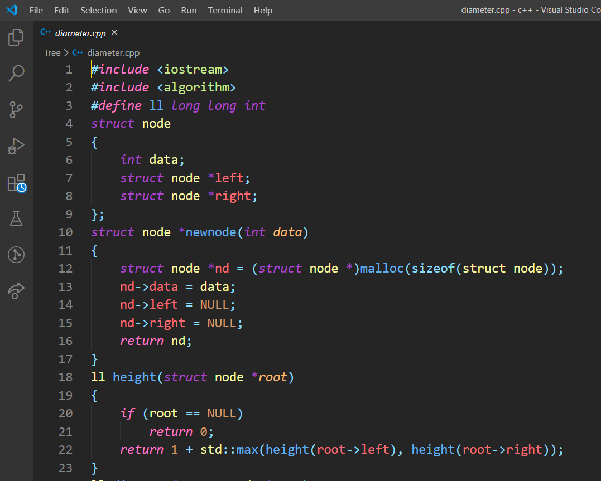
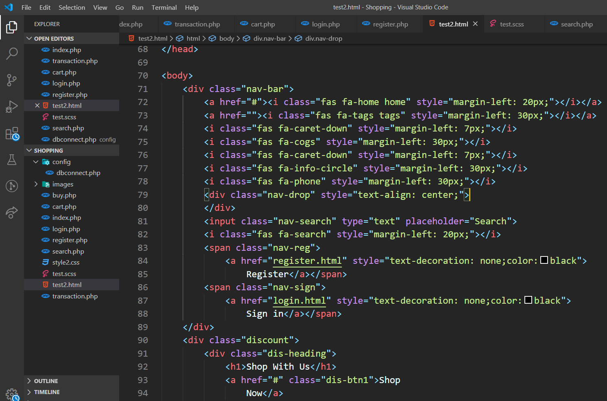
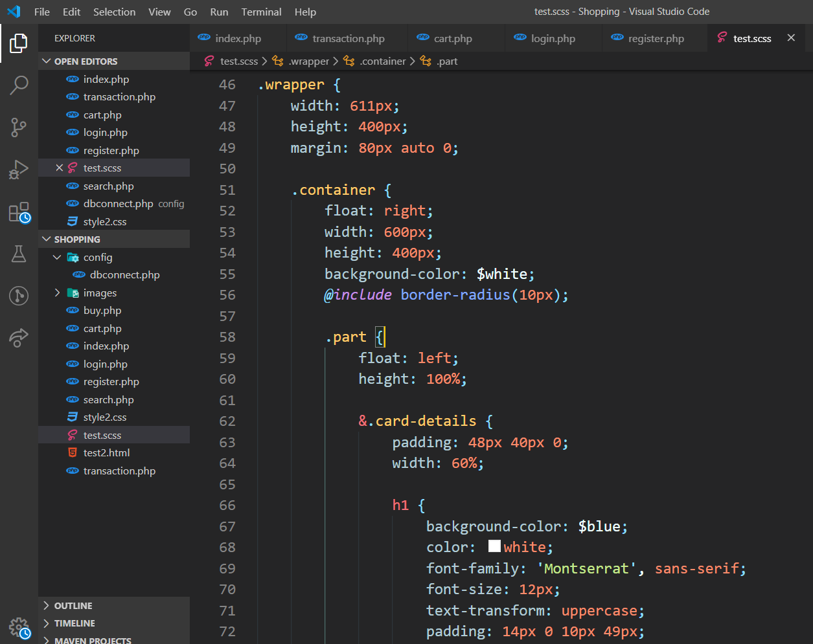

# Dark One Theme For Vs Code

[Dark One](https://marketplace.visualstudio.com/items?itemName=dev1ce.dev1ce) is a theme for dark mode.

<p align="center">
  <a href="https://marketplace.visualstudio.com/items?itemName=dev1ce.dev1ce">
    </a>
  <a href="https://marketplace.visualstudio.com/items?itemName=dev1ce.dev1ce">&nbsp;&nbsp;&nbsp;&nbsp;
    </a>
  <a href="https://marketplace.visualstudio.com/items?itemName=dev1ce.dev1ce">&nbsp;&nbsp;&nbsp;&nbsp;
    </a>
 </p>
 

## Installation

Install through VS Code extensions. Search for `Dark One`

[Visual Studio Code Market Place: Dark One](https://marketplace.visualstudio.com/items?itemName=dev1ce.dev1ce)

```
ext install dev1ce.dev1ce
```

## Activate theme

To Launch :

  -  Linux `Ctrl + Shift + P`
  -  MacOS `⌘ + Shift + P`
  -  Windows `Ctrl + Shift + P`

Type `theme`, choose `Preferences: Color Theme`, and select Dark One.

### C++

  
  <br />

### HTML/php
  
  <br />

### css/scss
  
 <br />
 

